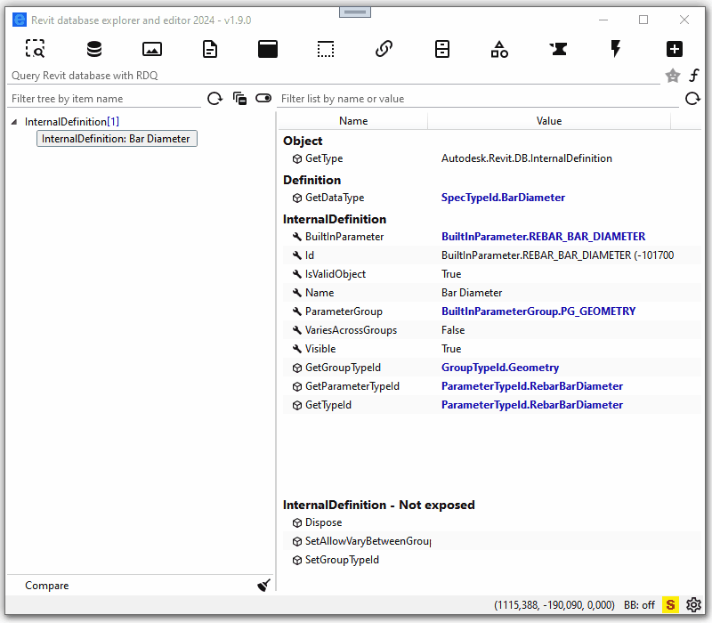
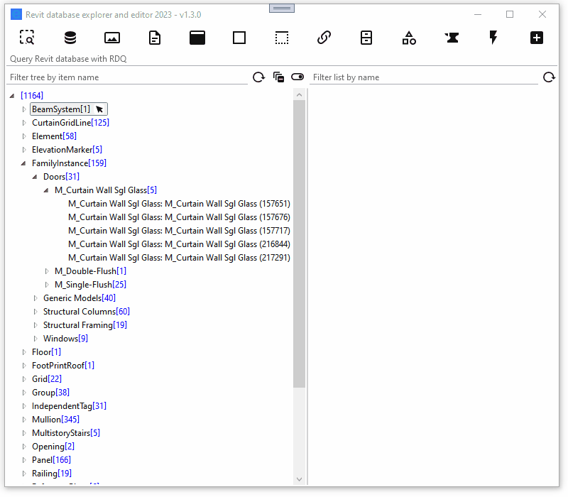

# Revit database explorer (RDBE)

The fastest, modern, asynchronous Revit database exploration tool for Revit 2021+ 

## Origin

Yet another [RevitLookup](https://github.com/jeremytammik/RevitLookup) clone. RevitLookup is a mature and indispensable tool to work with Revit. But its code had many authors and architectural changes(reflection, modeless) through time which led to quite significant technical debt and lack of consistency. For worse, its UI is still based on WinForms ... When I was adding support for [modeless windows #93](https://github.com/jeremytammik/RevitLookup/pull/93) to RevitLookup , I knew that at some point in time I will rewrite it whole. So here we are, let me introduce you to RDBE, a completely rewritten RevitLookup with WPF UI and a few small improvements:

- [query Revit database from UI](#possibility-to-query-Revit-database)
- [filterable tree of elements and list of properties and methods](#filterable-tree-of-elements-and-list-of-properties-and-methods)
- [easy access to Revit API documentation](#easy-access-to-revit-api-documentation)
- [edit parameter value](#edit-parameter-value)
- [extensive support for ForgeTypeId](#extensive-support-for-forgetypeid)
- [better support for Revit Extensible Storage](#better-support-for-revit-extensible-storage)
- [easier work with Element.Geometry](#easier-work-with-elementgeometry)
- [dark and light UI themes](#dark-and-light-ui-themes)
- [more advanced tree view](#more-advanced-tree-view)
- [snoop Revit events](#snoop-revit-events-with-rem-revit-event-monitor)
- [snoop external applications](#snoop-external-applications-aka-add-ons-loaded-into-revit)
- [snoop updaters](#snoop-updaters)
- [more data exposed](#more-data-exposed-from-revit-database)

## Installation

- Download and install [RevitDBExplorer.msi](https://github.com/NeVeSpl/RevitDBExplorer/releases/latest/download/RevitDBExplorer.msi). Setup will install RDBE for Revit 2021, 2022, 2023, 2024.

## Features

### query Revit database (RDQ) from UI with RQL (Revit query language)

RDQ is able to interpret words separated by `,` as element ids, Revit classes, categories and parameters. It builds from them FilteredElementCollector and uses it to query Revit database. The table with a description of RQL is below the example.

#### RQL - Revit query language
 
input/keywords | interpretation | translates to in Revit Api
----------|------------| ----
`,`, `;` | seperates phrases/commands
`:` | [classifier](#classifiers)
`active`,  `active view` | select elements from active view | new VisibleInViewFilter()
`type`,  `element type`,  `not element`  | select only element types | .WhereElementIsElementType()
`element`,  `not element type`,  `not type` | select only elements | .WhereElementIsNotElementType()
e.g. `123456` - number | select elements with given id  | new ElementIdSetFilter(new [] {new ElementId(123456)})
e.g. `Wall` - revit class | select elements of given class | .OfClass(typeof(Wall)) or  new ElementMulticlassFilter()
e.g. `OST_Windows` - revit category | select elements of given category | .OfCategory(BuiltInCategory.OST_Windows) or  new ElementMulticategoryFilter()
e.g. `Level 13` - level name | select elements from given level | new ElementLevelFilter()
e.g. `Room 44` - room name | select elements from given room | new ElementIntersectsSolidFilter()
e.g. `Approved Connections` - filter name | select elements that pass rule-based filter | ParameterFilterElement.GetElementFilter()
`param = value` | a phrase that uses [any of the operators](#operators) is recognised as a search for a parameter (value)| new ElementParameterFilter()
`foo` - any not recognized text | wildcard search for a given text in parameters:  Name,  Mark,  Type Name,  Family and Type | ParameterFilterRuleFactory.CreateContainsRule(),   BuiltInParameter.ALL_MODEL_TYPE_NAME,  BuiltInParameter.ALL_MODEL_MARK,  BuiltInParameter.ELEM_FAMILY_AND_TYPE_PARAM,  BuiltInParameter.DATUM_TEXT
`s:column`|select elements matching a structural type|new ElementStructuralTypeFilter()

Queries are case-insensitive. Matching for categories/classes/parameters is done in a fuzzy way, you do not have to be very precise with names, but this may lead to some false positive results. 

A value you are searching for is not parsed/interpreted (yet), which means that it uses internal Revit storage units/form, not Revit UI units. For parameters that have StorageType.String, you can do a wildcard search by using `%` or  `*` at the beginning and/or end of searching text e.g. `Mark = *foo%`

classifier | meaning
-----------|-------
`i:[text]`,`id:[text]`, `ids:[text]` | interpret `[text]` as an ElementId
`c:[text]`, `cat:[text]`, `category:[text]` | interpret `[text]` as a BuiltInCategory
`t:[text]`, `type:[text]`, `class:[text]`, `typeof:[text]` | interpret `[text]` as an element type/class
`n:[text]`, `name:[text]` | 
`s:[text]`, `stru:[text]`,  `structual:[text]`| interpret `[text]` as a structural type
`l:[text]`, `lvl:[text]`,  `level:[text]`| interpret `[text]` as a level 
`r:[text]`, `room:[text]`| interpret `[text]` as a room
`f:[text]`, `filter:[text]`, | interpret `[text]` as a rule-based filter

operator | meaning | example
-|-|-
`!=`, `<>` | NotEquals | `Length != 0`
`>=` | GreaterOrEqual | `Length >= 0`
`<=` | LessOrEqual | `Length <= 0`
`??` | HasNoValue, parameter exists but has no value | `Length ??`
`!!` | HasValue, paramater exists and has value | `Length !!`
**`?!`** | **Exists, element has given parameter**| `Length ?!`
`=` | Equals | `Length = 0`
`>` | Greater | `Length > 0`
`<` | Less | `Length < 0`

### filterable tree of elements and list of properties and methods

### easy access to Revit API documentation

 Tooltips work out-of-box, RevitApi.chm file is part of [Revit SDK](https://www.autodesk.com/developer-network/platform-technologies/revit) and path to it needs to be set manually.

### edit parameter value

### extensive support for ForgeTypeId

We all love (or hate) the ForgeTypeId, RDBE exposes all data related to a given ForgeTypeId scattered through many utils. You can also snoop all ForgeTypeIds returned from: 
- ParameterUtils.GetAllBuiltInGroups
- ParameterUtils.GetAllBuiltInParameters
- UnitUtils.GetAllMeasurableSpecs
- UnitUtils.GetAllDisciplines
- SpecUtils.GetAllSpecs
- UnitUtils.GetAllUnits

### better support for Revit Extensible Storage

RDBE allows you to snoop all schemas that are loaded into Revit memory, and you can easily get all elements that have an entity of a given schema. You get access to Extensible Storage data exactly like through RevitApi, by invoking: Element.GetEntity(). In contrast to Revit Lookup, you will only see entities that you can read and really exist in a given element. (Revit Lookup shows an exception when cannot access an entity even when an entity does not exist in a given element....)

### easier work with Element.Geometry

Not only you have faster access to a geometry of an element, but you can also select an instance of GeometryObject in Revit if it has a valid reference.  

### dark and light UI themes

### more advanced tree view

With grouping on many levels, and possibility to switch between grouping by Type or Category on the first level.

### snoop Revit events with REM (Revit Event Monitor)

A new take on [EventsMonitor from  RevitSdkSamples
](https://github.com/jeremytammik/RevitSdkSamples/tree/master/SDK/Samples/Events/EventsMonitor/CS). RDBE stores the latest 30 events that occurred during Revit session and allows to snoop them. UIControlledApplication.Idling event and ControlledApplication.ProgressChanged event are not stored because they are too noisy - they happen too often. In order to use this feature, you need to enable event monitor, which by default is disabled.

### snoop external applications (aka add-ons) loaded into Revit

RDBE allows to look deeper into UIApplication.LoadedApplications

### snoop updaters

RDBE allows to look deeper into UpdaterRegistry.GetRegisteredUpdaterInfos(). What is special about this feature is that, with a bit of luck, it is able to get UpdaterId, as a first publicly available tool.

### more data exposed from Revit database

In comparison to RevitLookup, RDBE in addition gives access to:

- BasicFileInfo
    - Extract
- Category
    - IsBuiltInCategory
    - GetBuiltInCategory
    - GetBuiltInCategoryTypeId
- Curve
    - GetEndParameter
- Document
    - GetTypeOfStorage
    - GetChangedElements
    - GetDefaultElementTypeId
    - GetDocumentVersion
    - GetWorksetId
    - EditFamily
- Element
    - **GetMaterialIds**
    - GetMaterialArea
    - GetMaterialVolume    
- FormatOptions
    - GetValidSymbols
    - CanHaveSymbol
- **HostObject**
    - **FindInserts**
- **HostObjectUtils**
    - **GetTopFaces**
    - **GetBottomFaces**
    - **GetSideFaces**
- **JoinGeometryUtils**
    - **GetJoinedElements**
    - **IsCuttingElementInJoin** 
- LabelUtils
    - GetLabelForBuiltInParameter
    - GetLabelForGroup
    - GetLabelForUnit
    - GetLabelForSpec
    - GetLabelForSymbol
    - GetLabelForDiscipline
- ParameterUtils
    - IsBuiltInParameter
    - GetBuiltInParameter
    - IsBuiltInGroup
    - GetBuiltInParameterGroup
- Rebar
    - DoesBarExistAtPosition 
    - **GetCenterlineCurves** 
    - GetCouplerId 
    - GetEndTreatmentTypeId 
    - **GetFullGeometryForView**
    - GetHookOrientation
    - GetHookRotationAngle
    - GetHookTypeId
    - **GetMovedBarTransform**
    - **GetOverridableHookParameters**
    - **GetTransformedCenterlineCurves**
    - IsBarHidden
- RebarBarType
    - GetAutoCalcHookLengths,
    - GetHookLength, 
    - GetHookOffsetLength, 
    - GetHookPermission
    - GetHookTangentLength
- RebarShapeDrivenAccessor
    - **GetBarPositionTransform**
- ScheduleDefinition
    - GetFilter
    - GetSortGroupField
- SpatialFieldManager
    - GetSpatialFieldManager
    - GetResultSchema
- SpecUtils
    - IsValidDataType
    - IsSpec
- StructuralSectionUtils
    - GetStructuralSection
- TableView
    - GetAvailableParameters
- UnitFormatUtils
    - Format
- UnitUtils
    - IsMeasurableSpec
    - IsSymbol
    - IsUnit
    - GetDiscipline
    - GetTypeCatalogStringForSpec
    - GetTypeCatalogStringForUnit
    - GetValidUnits
- Wall
    - IsWallCrossSectionValid
- WorksharingUtils
    - GetCheckoutStatus
    - GetModelUpdatesStatus
    - GetWorksharingTooltipInfo
- View
    - CanViewBeDuplicated
    - **GetElementOverrides**
    - IsInTemporaryViewMode
    - SupportsWorksharingDisplayMode    
- ViewCropRegionShapeManage
    - GetSplitRegionMaximum
    - GetSplitRegionMinimum

